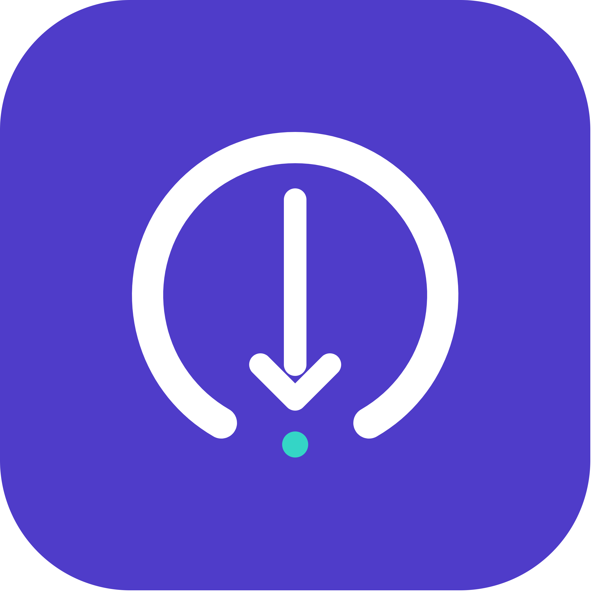

<p align="center">
  
</p>

# 🚀 Arc Downloader (Part of the [Team Arc](https://telegram.dog/ArcBotz))

A Telegram bot that fetches and delivers media — right into any chat, or straight through inline mode — backed by the [Arc API](https://portal.arcmusic.fun).

Send it a song name, a link from YouTube, Spotify, SoundCloud, Apple Music, JioSaavn, or Terabox, or a link from Instagram, Facebook, Threads, Bluesky, TikTok, Twitter/X, Pinterest, or Reddit, and it downloads, prepares, and sends the file back to you. In group and private chats it replies directly; in inline mode (`@YourBot <query>`) it delivers into whatever chat you're typing in, no need to leave the conversation.

## ✨ Features

- 🔍 **Search & direct links** — type a song name for top matches, or paste a supported link to fetch it straight away
- 📃 **Playlists** — YouTube, Spotify, Apple Music, and JioSaavn playlist/album links are listed with paginated, tap-to-download results
- ⚡ **Inline mode** — `@YourBot <query>` fetches and delivers the result directly into any chat, auto-starting the moment a result is picked
- 🎵 **Apple Music & JioSaavn support** — single tracks and full playlists/albums, alongside YouTube, Spotify, and SoundCloud
- 📱 **Social media downloads** — Instagram, Facebook, Threads, Bluesky, TikTok, Twitter/X, Pinterest, and Reddit media links
- 📦 **Terabox support** — private chat only; every file from a share link is delivered with quality/watch buttons and auto-deleted from the chat 10 minutes after sending
- 🌍 **Multi-language support** — English (default), Russian, Burmese, and Spanish; anyone can switch with `/lang`, saved per-user in MongoDB — see [Languages](#-languages) below
- 🎚️ **Automatic audio normalization** — YouTube downloads are probed and transcoded (via `ffmpeg`) to a consistent, playable format with embedded thumbnail and metadata
- 🤖 **Clone this bot** — any user can spin up their own copy of Arc Downloader, running under their own bot account, straight from `/start`; see [Clone feature](#-clone-feature) below
- 🛠️ **Admin tools** — `/stats` and `/broadcast` for bot owners and sudo users
- 🗄️ **MongoDB-backed user tracking** — minimal footprint, used only for broadcast targeting, language preference, and keeping cloned bots alive across restarts

## ⚙️ How it works

```
User message / inline query
        │
        ▼
  Classifier (bot/utils/classifier.py)
   detects: search | youtube | spotify | soundcloud | apple music |
            jiosaavn | terabox | social link
        │
        ├── terabox ──────────────────────────────┐
        │                                          ▼
        │                            Terabox flow (bot/dl/terabox_flow.py)
        │                             resolves every file in the share link,
        │                             sends each with quality buttons, and
        │                             auto-deletes them after 10 minutes
        ▼
  Arc API (bot/dl/api_client.py)
   resolves the query to a CDN url
        │
        ▼
  Downloader (bot/dl/downloader.py)
   fetches the file, transcodes if needed, attaches thumbnail + caption
        │
        ▼
  Delivered to the chat (private/group) or edited straight
  into place for inline results — all in the user's chosen language
```

Inline deliveries don't need to relay through any other chat to obtain a `file_id` — the freshly downloaded file is uploaded directly over MTProto and used to edit the placeholder result in place.

## 🌍 Languages

Every user-facing string — start/privacy messages, button labels, status updates, error messages — lives in `bot/locale/*.json`, one file per language:

| Code | Language |
|---|---|
| `en` | English (default) |
| `ru` | Русский |
| `my` | မြန်မာ |
| `es` | Español |

Anyone can switch language at any time with `/lang`, which shows a tappable language picker; the choice is stored per-user in MongoDB (`bot/core/mongo.py`) and cached in memory so it's picked up instantly on every future message, callback, or inline query. `bot/locale/__init__.py` loads all catalogs once at startup and falls back to English for any key missing in another language, so partial translations never break a reply.

To add a new language, drop a new `bot/locale/<code>.json` with the same keys as `en.json`, add its code to `supported_langs` in `bot/locale/__init__.py`, and it shows up in `/lang` automatically.

## 🤖 Clone feature

Anyone talking to the main bot can create their own independent copy of Arc Downloader:

1. Tap **🤖 Clone this bot** on `/start` and follow Telegram's managed-bot creation flow.
2. Arc Downloader receives the new bot's token, launches a `Client` for it, wires up the same search/download/inline/lang handlers the main bot uses, and applies shared branding (profile photo, short description, description).
3. The clone is fully independent — it fetches from the same Arc API and behaves exactly like the main bot — and is owned by whoever created it.
4. Owners manage their clones any time with `/mybot`: start, stop, or delete each one.
5. Every clone is recorded in MongoDB, so it's automatically relaunched if the main bot restarts.

Cloning is a main-bot-only capability — a clone can't be used to create further clones or manage anyone else's.

Inline mode and inline feedback are **not** enabled automatically on a freshly cloned bot. Telegram doesn't expose an API for a manager bot to toggle another bot's `/setinline` or `/setinlinefeedback` settings — those remain BotFather-only, owner-gated switches (confirmed against the [Managed bots API](https://core.telegram.org/api/bots/managed-bots), which only exposes token export and access-restriction controls). Arc Downloader tells every new clone owner about this in the "clone launched" message and points them to the same two BotFather commands described below.

## ✅ Requirements

- Python 3.11+
- [ffmpeg](https://ffmpeg.org/) and `ffprobe` available on `PATH`
- A MongoDB instance (local or hosted, e.g. MongoDB Atlas)
- A Telegram bot token from [@BotFather](https://t.me/BotFather)
- API credentials for `api_id` / `api_hash` from [my.telegram.org](https://my.telegram.org)
- Access key for a deployed instance of the [Arc API](https://portal.arcmusic.fun)

## 💻 Local development

```bash
git clone https://github.com/tusar404/ArcDLBot.git
cd ArcDLBot

# ffmpeg (and ffprobe) — required by bot/dl/ffmpeg.py
sudo apt update && sudo apt install -y ffmpeg
# macOS: brew install ffmpeg   |   Windows: choco install ffmpeg

pip3 install -U -r requirements.txt

cp sample.env .env
vi .env

python3 -m bot
```

### Environment variables

| Variable | Required | Description |
|---|---|---|
| `API_ID` | Yes | Telegram API ID from [my.telegram.org](https://my.telegram.org) |
| `API_HASH` | Yes | Telegram API hash from [my.telegram.org](https://my.telegram.org) |
| `BOT_TOKEN` | Yes | Bot token from [@BotFather](https://t.me/BotFather) |
| `API_URL` | Yes | Base URL of your deployed Arc API instance |
| `API_KEY` | Yes | API key for the Arc API |
| `MONGO_URI` | Yes | MongoDB connection string |
| `OWNER_ID` | Yes | Your numeric Telegram user ID |
| `SUDO_USERS` | No | Comma-separated numeric user IDs with admin command access, in addition to `OWNER_ID` |

### Enable inline delivery in @BotFather

Inline mode itself, and inline feedback, are settings Telegram only lets a bot's owner change — there's no Bot API or MTProto method for a third party (including a manager bot) to flip them, so this step can't be scripted:

1. Message [@BotFather](https://t.me/BotFather)
2. `/setinline` → select your bot → set any placeholder text
3. `/setinlinefeedback` → select your bot → `100%`

Without step 3, Telegram won't notify the bot when an inline result is chosen, and delivery will only happen if the user manually taps the Retry button. This applies to the main bot and to every cloned bot individually — each clone owner needs to do it once for their own bot.

### Enable the clone feature in @BotFather

Cloning relies on Telegram's managed-bot (Business Bots) capability:

1. Message [@BotFather](https://t.me/BotFather)
2. Enable managed bots for your bot so it can request and receive tokens for bots created on its behalf

## 🐳 Docker

`ffmpeg` and all Python dependencies are installed inside the image, so there's nothing to install on the host beyond Docker itself.

```bash
git clone https://github.com/tusar404/ArcDLBot.git
cd ArcDLBot

cp sample.env .env
vi .env

docker compose up -d --build
```

This starts the bot alongside a local MongoDB container and persists `downloads/` and Mongo's data as volumes. Already running your own Mongo (e.g. Atlas)? Point `MONGO_URI` in `.env` at it, then remove the `mongo` service and its `depends_on` line from `docker-compose.yml` — see the comment at the top of that file.

To build and run the image directly instead of via compose:

```bash
docker build -t arc-dl-bot .
docker run -d --restart unless-stopped --env-file .env -v $(pwd)/downloads:/app/downloads arc-dl-bot
```

## 📁 Project structure

```
bot/
├── assets/        # profile photo used to brand the main bot and every clone
├── core/          # client, config, mongo (users, clones, language), clone manager, filesystem setup
├── dl/            # Arc API client, download/delivery pipeline, Terabox flow, ffmpeg helpers
├── handlers/      # thin Pyrogram entry points only — one file per update type
│                  # (start, search, callback, inline, lang, admin, clones),
│                  # each declaring a HandlerRegistry and delegating to bot/utils
├── locale/        # en/ru/my/es.json translation catalogs + the loader (bot/locale/__init__.py)
└── utils/         # caching, classification, keyboards, formatting, and every
                   # handler's business logic (search dispatch, inline result
                   # building, clone UI, broadcast, onboarding, stats)
```

Each handler module (`bot/handlers/*.py`) only wires Pyrogram update types to plain functions via a small `HandlerRegistry` (`bot/utils/helper.py`). All actual logic lives in `bot/utils/` and `bot/dl/`, so a handler file is never more than the registration boilerplate plus a couple of lines forwarding to a utility function.

## 📄 License

MIT — see [LICENSE](LICENSE).
